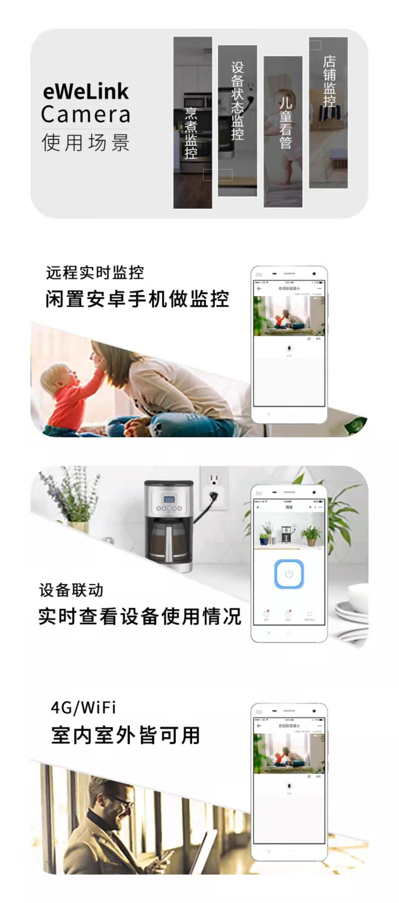

<!--
 * @Author: Carl
 * @Date: 2021-01-29 18:11:12
 * @LastEditors: Carl
 * @LastEditTime: 2021-02-03 15:48:28
-->

# 易微联手机摄像头APP连接第三方蓝牙设备控制协议说明

## 一、产品简介

易微联摄像头APP是一款将安卓手机用作网络摄像头的应用程序。将手机作为网络摄像头，照看家中的儿童、宠物，用作安全监控等，闲置手机再利用，节省购买新摄像头的花销。

## 二、对接自有蓝牙设备

目前易微联摄像头APP已支持连接易微联推出的云台硬件（蓝牙），用户可以通过易微联客户端远程操作云台，实现摄像头的上下移动，更方便监控家中情况。

为了方便开发者DIY，特将操作的蓝牙指令协议开放，见下文：

用户可以通过易微联客户端远程让手机摄像头连上特定蓝牙设备，然后通过酷宅提供的蓝牙指令或者自定义蓝牙指令来控制蓝牙设备。

### 2.1 转动云台

可实现：指定方向、角度转动，或者持续转动

| 2 Bytes | 2 Bytes     | 1 Bytes   | 2 Bytes | 1 Bytes  |      1 Bytes |
| ------- | ----------- | --------- | ------- | -------- | ------------ |
| cmd_id  | data_length | direction | degrees | velocity | sum          |
| 0x0001  | 0x0004      | 0x01      | 0x000F  | 0x1E     | 0x15         |

参数说明：

- cmd_id：0x0001（转动云台）；
- data_length：数据长度；
- direction：0x01 向左、0x02 向右、0x03 向上、0x04 向下、0x00停止转动；
- degrees：按指定角度转动（范围0x0001-0x0167），持续转动或停止转动填 0x0000；
- velocity：角速度(每秒转动的角度 rad/s)，仅在持续转动模式下生效，建议取值 1～60；
- sum：指令的校验和，前面所有字段值的和(cmd_id，到velocity)；

说明：如果在执行转动的过程中，又收到这个指令，则按新的指令要求来转动。

**其他指令待后续补充。**
